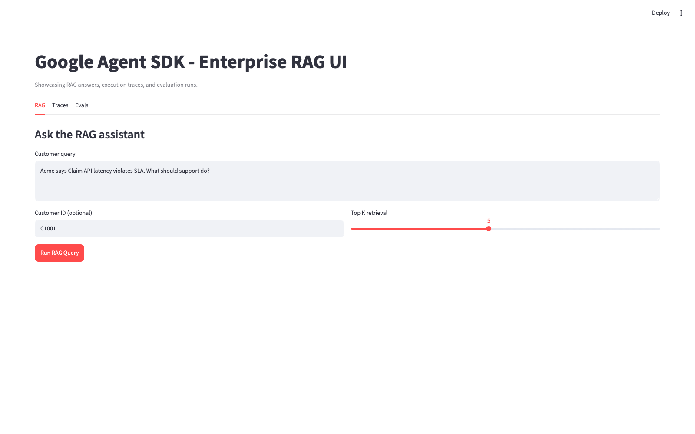

# Google Agent SDK

A production-style **Retrieval-Augmented Generation (RAG)** starter project that demonstrates how to use **Google ADK** to answer customer questions from both:

- **Structured enterprise data** (CRM records, support tickets, billing-style tables)
- **Unstructured enterprise content** (policies, knowledge base, docs, PDFs, DOCX)

This repository is designed for customer support and customer success scenarios where responses must be grounded in enterprise truth and include source-backed context.

Repository: [https://github.com/letslego/google-agent-sdk](https://github.com/letslego/google-agent-sdk)

## What This RAG Pipeline Does

When a customer asks a question, the system:

1. Ingests and normalizes enterprise data from structured and unstructured sources.
2. Enriches each chunk/record with metadata (source path, table name, customer_id, chunk_id).
3. Indexes content into:
   - a **vector store** (semantic retrieval via Chroma), and
   - a **lexical store** (keyword retrieval via TF-IDF).
4. Runs **hybrid retrieval** (reciprocal rank fusion) for high recall + precision.
5. Feeds grounded context to a **Google ADK agent tool**.
6. Produces an answer with evidence-oriented behavior and citations.

## Included Features

- Multi-source ingestion for enterprise data domains
- Chunking strategy for long unstructured documents
- Metadata-aware filtering (`customer_id`-scoped retrieval)
- Hybrid retrieval (semantic + lexical fusion)
- BigQuery connector for enterprise warehouse ingestion
- Optional Vertex AI embedding-based reranking
- Skills registry search for intent-to-playbook matching (`search_skill_registry`)
- Explicit skill execution for response workflow control (`use_skill`)
- ADK tool-based grounding pattern (`retrieve_enterprise_context`)
- Web UI with tabs for RAG, traces, and evals
- Groundedness evaluation script with pass/fail checks
- FastAPI retrieval endpoint for service integration
- Sample datasets for immediate local demo
- Architecture documentation and Makefile automation

## Repository Layout

```text
google-agent-sdk/
├── data/samples/
│   ├── structured/            # CSV enterprise records
│   └── unstructured/          # Policies / KB text
├── docs/
│   └── architecture.md
├── scripts/
│   ├── ingest.py
│   └── evaluate_groundedness.py
├── src/enterprise_rag/
│   ├── adk_agent/agent.py     # Google ADK root agent + tool
│   ├── connectors/            # Structured/unstructured loaders
│   ├── ingestion/pipeline.py  # End-to-end ingest + retrieve
│   ├── retrieval/             # Vector + hybrid + Vertex rerank logic
│   └── app.py                 # FastAPI service
├── .env.example
├── Makefile
└── pyproject.toml
```

## Quick Start

### 1) Create environment and install dependencies

```bash
python3 -m venv .venv
source .venv/bin/activate
pip install --upgrade pip
pip install -e ".[dev]"
```

### 2) Configure environment variables

```bash
cp .env.example .env
```

Set your `GOOGLE_API_KEY` in `.env`.

### 3) Ingest enterprise data

```bash
make ingest
```

Optional BigQuery ingestion (set in `.env` before ingestion):

```bash
RAG_ENABLE_BIGQUERY_INGESTION=true
GCP_PROJECT_ID=your-project-id
BIGQUERY_DATASET=support_analytics
BIGQUERY_TABLES=tickets,accounts,billing_events
```

### 4) Run the ADK agent

```bash
make run-adk
```

Alternative ADK web UI:

```bash
adk web src/enterprise_rag/adk_agent
```

### 5) Optional: run retrieval API

```bash
make run-api
```

Sample request:

```bash
curl -X POST http://127.0.0.1:8000/retrieve \
  -H "Content-Type: application/json" \
  -d '{
    "query":"What SLA and response policy applies to Acme Health latency issue?",
    "customer_id":"C1001",
    "top_k":5
  }'
```

### 6) Run the UI (RAG + Traces + Evals tabs)

```bash
make run-ui
```

Then open the Streamlit URL shown in your terminal (typically `http://localhost:8501`).

### 7) Run groundedness evaluation (pass/fail)

```bash
make eval-groundedness
```

Results are written to `logs/groundedness_eval_results.json`.

## UI Showcase

The Streamlit UI is designed for demos and stakeholder reviews. It exposes the full RAG loop and makes traces/evals easy to inspect without using raw API calls.



### What each tab demonstrates

- **RAG**: interactive customer query workflow with `customer_id`, retrieval depth (`top_k`), grounded answer, retrieved context, and trace metadata
- **Traces**: execution transparency for each run (selected skill, tool-call steps, latency, and retrieved evidence sources)
- **Evals**: one-click benchmark run from `data/evals/eval_cases.json` with pass/fail, keyword hit rate, and latency KPIs

### Suggested demo flow (3 minutes)

1. In **RAG**, run: `Acme says Claim API latency violates SLA. What should support do?`
2. Open **Retrieved Context** and **Trace Metadata** to show grounding + tool steps.
3. Switch to **Traces** and inspect the latest `trace_id`.
4. Run **Evals** and present pass rate + average latency.

### UI troubleshooting

- If the default URL is busy, Streamlit auto-selects the next port (`8502`, `8503`, ...).
- If the page looks stale, hard refresh (`Cmd+Shift+R`).
- For local demo stability, lexical retrieval is enabled by default; set `RAG_ENABLE_VECTOR_SEARCH=true` in `.env` to enable vector retrieval.
- To enable Vertex reranking, set `RAG_ENABLE_VERTEX_RERANK=true` and configure `GCP_PROJECT_ID`.

## BigQuery Connector

The ingestion pipeline supports warehouse ingestion via BigQuery when enabled.

- Connector module: `src/enterprise_rag/connectors/bigquery_loader.py`
- Source URI metadata format: `bigquery://<project>.<dataset>.<table>`
- Customer-aware metadata: if a `customer_id` column exists, it is mapped into retrieval filters

Required environment settings:

```bash
RAG_ENABLE_BIGQUERY_INGESTION=true
GCP_PROJECT_ID=your-project-id
BIGQUERY_DATASET=your_dataset
BIGQUERY_TABLES=tickets,accounts
BIGQUERY_LIMIT_PER_TABLE=500
```

## Vertex AI Reranking

Optional reranking can be enabled to rescore retrieved candidates with Vertex embeddings:

```bash
RAG_ENABLE_VERTEX_RERANK=true
GCP_PROJECT_ID=your-project-id
GCP_LOCATION=us-central1
VERTEX_EMBEDDING_MODEL=text-embedding-005
```

When enabled, the retriever keeps hybrid retrieval as first-pass recall, then reranks top candidates for better ordering relevance.

## Groundedness Evaluation Script

`scripts/evaluate_groundedness.py` runs evaluation cases and computes groundedness pass/fail by checking whether answer claims are supported by retrieved context.

Output includes:

- per-case groundedness score
- pass/fail status
- selected skill and trace id
- latency per case
- global pass rate summary

## Example Customer Queries

- "My Claim API is slow for Acme Health. What support policy applies and what are the required update intervals?"
- "For customer C1002, what is the current ticket status and likely billing reconciliation steps?"
- "For Nimbus Logistics webhook retries, what mitigation guidance is documented?"

## Skills Registry + Tool Calling Demo

This project now demonstrates a complete ADK tool-calling loop:

1. **Skill search tool call**: `search_skill_registry(query="...")`
2. **Skill use tool call**: `use_skill(skill_id="...")`
3. **Grounding tool call**: `retrieve_enterprise_context(query="...", customer_id="...")`
4. **Final answer**: combines skill playbook + retrieved enterprise evidence

### Included skills

- `sla_incident_response` for high-priority API/SLA incidents
- `billing_reconciliation` for invoice and usage mismatch workflows
- `webhook_recovery` for callback delivery/retry failures

### Example tool-calling trace (conceptual)

```text
User: "Acme says their Claim API latency violates SLA. What do we do?"
Tool -> search_skill_registry("claim api latency SLA") => sla_incident_response
Tool -> use_skill("sla_incident_response") => incident response playbook
Tool -> retrieve_enterprise_context(query, customer_id="C1001") => ticket + policy context
Agent: grounded answer with [1], [2] citations and concrete next actions
```

## Extending to Real Enterprise Data

Replace sample loaders with connectors to:

- Data warehouses (BigQuery, Snowflake, Databricks)
- Operational DBs (Postgres, SQL Server, Oracle)
- Ticketing systems (ServiceNow, Jira, Zendesk)
- Knowledge platforms (Confluence, SharePoint, Drive)

Recommended production upgrades:

- PII redaction and access policy enforcement per tenant
- Re-ranker model for final context ordering
- Query rewriting and intent routing agent
- Response schema validation and confidence scoring
- Evaluation harness (answer quality, grounding, latency)
- Observability dashboards and trace collection

## Architecture

See [`docs/architecture.md`](docs/architecture.md).

## GitHub: Create and Push a New Repository

From this project root:

```bash
git init
git add .
git commit -m "Initial commit: enterprise RAG pipeline with Google ADK"
gh repo create google-agent-sdk --public --source=. --remote=origin --push
```

If you prefer private visibility:

```bash
gh repo create google-agent-sdk --private --source=. --remote=origin --push
```

## Why This Is Useful for Customer Query Answering

This pipeline combines enterprise tabular truth with policy and KB narrative context. The result is a support agent that can answer customer questions with:

- Better factual grounding
- Better handling of account-specific context
- Better explainability via source-backed responses
- Consistent operations using skill playbooks selected through tool calls

---

If you want, I can next add:

- BigQuery partition filters and incremental ingestion checkpoints
- Vertex cross-encoder reranking with calibrated relevance thresholds
- CI automation to fail PRs when groundedness pass rate drops
